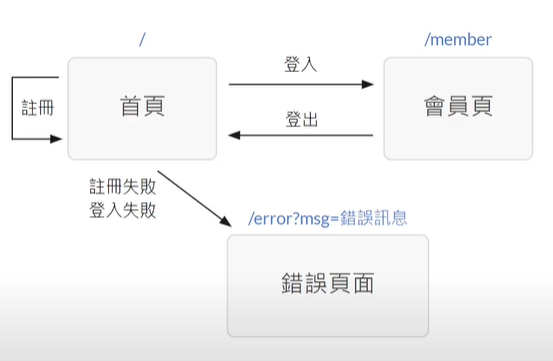

#### Python Flask 網站後端開發 
# 會員系統開發 : Built FrontEnd Pages(建立前端頁面)

# 1.前端頁面規劃 :  
+ 思考 : 開發一個專案該如何下手 ? 
    + 站在使用者的角度思考如何使用此網站(操作流程)
+ 三個頁面規劃 :
    + 1.首頁(註冊, 登入)
    + 2.會員頁
    + 3.錯誤頁面
 
 + Visualize : 
 

# 2.基礎後端設定 : 完成基礎的Flask後端相關程式啟動伺服器 

+ 載入Flask所有相關工具
    + 建立Application物件, 靜態檔案處理設定
+ 設定Session 的密鑰

# 3.資料庫連線準備 : 完成與資料庫連線, 隨時待命

+ 載入Pymongo套件 
    Import Pymongo
+ 連線到MongoDB雲端資料庫
    Client=pymongo.MongoClient("")
+ 選擇操作Member_System資料庫

